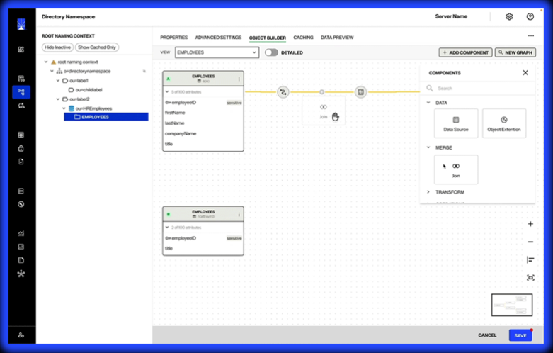

# This is a Title level 1

Lorem ipsum dolor sit amet, consectetur adipiscing elit, sed do eiusmod tempor incididunt ut labore et dolore magna aliqua. Ut enim ad minim veniam, quis nostrud exercitation ullamco laboris nisi ut aliquip ex ea commodo consequat. Duis aute irure dolor in reprehenderit in voluptate velit esse cillum dolore eu fugiat nulla pariatur. Excepteur sint occaecat cupidatat non proident, sunt in culpa qui officia deserunt mollit anim id est laborum.

## This is a Title level 2

- My first option
- My second option
- My third option

> This is an important topic, or a warning.

### This is a Title level 3

1. My first option
2. My second option
3. My third option


#### Procedure  

Lorem ipsum dolor sit amet, **consectetur adipiscing elit**, sed do eiusmod tempor _incididunt ut labore_ et dolore magna aliqua. Ut enim ad minim veniam, quis nostrud exercitation ullamco laboris nisi ut aliquip ex ea commodo consequat. Duis aute irure dolor in `reprehenderit` in voluptate velit esse cillum dolore eu fugiat nulla pariatur. Excepteur sint occaecat cupidatat non proident, sunt in culpa qui officia deserunt mollit anim id est laborum.

SQL Code example:
```sql
SELECT NAME_, VALUE_ FROM ACT_GE_PROPERTY WHERE NAME_ = 'schema.version' ;  
```

Javascript Code example:
```javascript
// the hello world program
console.log('Hello World');
```


Here is how to to add an image




This is an example of a [link](index.md) in a page


  
Table

| Tables   |      Are      |  Cool |
|----------|:-------------:|------:|
| col 1 is |  left-aligned | $1600 |
| col 2 is |    centered   |   $12 |
| col 3 is | right-aligned |    $1 |


